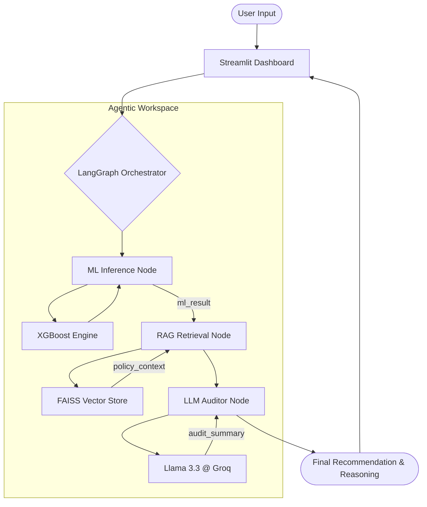

# CreditRisk AI — Agentic Credit Risk Intelligence Platform

An **Agentic AI** platform for credit risk assessment, combining a traditional XGBoost ML model with a **LangGraph-orchestrated agent**, **RAG-based credit policy retrieval**, and a **Groq/Llama 3.3 LLM auditor** — all wrapped in a dark fintech-style Streamlit dashboard.

> **Capstone Project · Semester 4 · AI/ML Programme**  
> 🚀 **Live Demo:** [genai-capstone-sem-4.streamlit.app](https://genai-capstone-sem-4.streamlit.app/)

---

## Overview

This project evolves a baseline ML credit risk classifier into a full **Agentic AI** system:

1. **XGBoost ML Engine** — classifies loan applicants as Good/Bad risk with default probability.
2. **RAG Policy Retriever** — retrieves relevant clauses from the Universal Bank Credit Policy using FAISS + Sentence Transformers.
3. **LangGraph Agentic Workflow** — orchestrates the ML and RAG steps, then routes to the LLM auditor.
4. **Groq/Llama 3.3 LLM Auditor** — reasons over the ML prediction and policy context to generate a grounded, explainable final recommendation.

**Dataset:** German Credit Data (1,000 applicants, UCI Repository)  
**ML Model:** XGBoost + GridSearchCV (recall-optimised)  
**Agentic Stack:** LangGraph · LangChain · Groq (Llama 3.3-70B) · FAISS · Sentence Transformers  
**UI:** Streamlit · Plotly

## System Architecture

The platform follows a modular **Agentic AI** architecture, where a traditional ML engine provides predictive signals that are subsequently audited by an LLM grounded in real-world credit policies via RAG.



## Project Structure

```
genai-capstone-sem-4/
├── data/
│   ├── german_credit_data.csv        # Raw dataset (UCI German Credit)
│   └── credit_policy.md              # Bank credit policy (RAG knowledge base)
├── models/
│   └── credit_risk_model_v2.pkl      # Trained XGBoost model artifact
├── report/
│   ├── agentic_ai_endsem.pdf         # Project report (PDF)
│   └── agentic_ai_endsem.tex         # LaTeX source
├── src/
│   ├── data.py                       # load_data() — CSV loading & cleaning
│   ├── preprocess.py                 # build_preprocessor(), split_data()
│   ├── train.py                      # train_model(), evaluate_model()
│   ├── predict.py                    # make_prediction() — inference helper
│   ├── rag.py                        # PolicyRetriever — FAISS-based RAG
│   └── agent.py                      # LangGraph agentic workflow
├── app.py                            # Streamlit dashboard (Agentic UI)
└── requirements.txt                  # Dependency list
```

---

## Core Components

### 1. Predictive Engine (XGBoost)
A production-grade **XGBoost** classifier trained on the UCI German Credit dataset. 
- **Optimization:** Hyperparameter tuning via `GridSearchCV` specifically optimizing for **Recall** (Safety-first approach to minimize False Negatives).
- **Preprocessing:** Robust pipeline using `ColumnTransformer` for categorical encoding and numerical scaling.
- **Metrics:** ~76% Accuracy \| 0.80 ROC-AUC.

### 2. RAG Pipeline (Policy Intelligence)
To move beyond black-box predictions, we implement a **Retrieval-Augmented Generation** layer.
- **Knowledge Base:** Internal "Universal Bank Credit Policy" (Markdown).
- **Processing:** `MarkdownHeaderTextSplitter` preserves the semantic structure of bank rules.
- **Vector Store:** **FAISS** index for high-performance similarity search.
- **Embeddings:** `all-MiniLM-L6-v2` for dense vector representation of policy clauses.

### 3. Agentic Orchestrator (LangGraph)
The system uses a **LangGraph State Machine** to coordinate between the ML model and the LLM.
- **State Schema:** A `TypedDict` (`AgentState`) tracks the client data, ML results, and retrieved policy snippets across the cycle.
- **State Transitions:**
    1. `START` → `predict_risk`: Generate probabilistic default score.
    2. `predict_risk` → `retrieve_policy`: Fetch specific rules relevant to the applicant's profile (e.g., age-based limits).
    3. `retrieve_policy` → `generate_audit`: Synthesize ML + Policy for the final verdict.
    4. `generate_audit` → `END`.

### 4. LLM Auditor (Llama 3.3)
Hosted on **Groq Cloud** for sub-second inference latency.
- **Model:** `llama-3.3-70b-versatile`.
- **Logic:** Evaluates if the ML prediction violates any "Hard Policies" (e.g., loan caps, age restrictions) and provides a human-readable grounding trace.

---

## Dashboard Features

| Panel | Description |
|---|---|
| **Navbar** | Live system status badge, version indicator |
| **Client Assessment** | Tabbed form — Demographics, Credit Profile, Financials |
| **KPI Cards** | Credit Amount · Duration · Job Level · Savings |
| **Risk Score** | Donut gauge showing default probability (green / amber / red) |
| **Client Profile** | At-a-glance stats grid |
| **Risk Analysis** | 3 key indicator checks with pass/fail signals |
| **Probability Scale** | Gradient bar with labelled percentage |
| **GenAI Auditor Report** | 🆕 LLM-generated, policy-grounded explanation with reasoning trace |
| **RAG Policy Snippets** | 🆕 Relevant credit policy rules retrieved for this applicant |

---

## Local Setup

### Prerequisites

- Python 3.9+ (Stable environment required for ML dependencies)
- A free **Groq API Key** — get one at [console.groq.com/keys](https://console.groq.com/keys)

---

### Local Setup Guide

```bash
# 1. Clone the repository
git clone https://github.com/HusainNST/genai-capstone-sem-4.git
cd genai-capstone-sem-4

# 2. Create and activate a stable virtual environment
python3 -m venv venv_stable
source venv_stable/bin/activate        # macOS / Linux
# venv_stable\Scripts\activate         # Windows

# 3. Upgrade pip and install dependencies
pip install --upgrade pip
pip install -r requirements.txt

# 4. Set up your API key
cp .env.example .env
# Open .env and fill in your GROQ_API_KEY

# 5. Launch the dashboard
streamlit run app.py
```


---

## API Key Setup

The Agentic AI auditor requires a **Groq API Key** (free tier available).

### Method 1: `.env` File (Persistent)

Create a `.env` file in the project root:

```env
GROQ_API_KEY=gsk_your_real_key_goes_here
```
The app will automatically load this via `python-dotenv`.

### Method 2: Dashboard Sidebar (Session Only)

No `.env` file needed. Open the app and enter your key in the **⚙️ Settings** sidebar. The key is used in-memory for that session only.

---

## Model Performance

Trained with 5-fold cross-validated GridSearchCV optimising for **Recall** (minimising missed bad loans).

| Metric | Score |
|---|---|
| Accuracy | ~76% |
| ROC-AUC | ~80% |
| Recall (Bad Loans) | ~68% |
| Optimiser | GridSearchCV (recall scoring) |

---

## Input Features

| Feature | Type | Description |
|---|---|---|
| Age | Numeric | Applicant age (18–80) |
| Sex | Categorical | male / female |
| Job | Ordinal | Skill level 0–3 |
| Housing | Categorical | own / free / rent |
| Saving accounts | Categorical | unknown / little / moderate / quite rich / rich |
| Checking account | Categorical | unknown / little / moderate / rich |
| Credit amount | Numeric | Loan amount in Deutsche Marks |
| Duration | Numeric | Loan term in months |
| Purpose | Categorical | car / education / business / etc. |

---

## Project Walkthrough

> [!NOTE]
> **Project Demo Video:** [Coming Soon / Link Placeholder]

---

## Tech Stack

| Layer | Technology |
|---|---|
| **ML Engine** | XGBoost, scikit-learn, imbalanced-learn |
| **Agentic Workflow** | LangGraph, LangChain |
| **Inference API** | Groq Cloud (Llama 3.3-70B) |
| **Vector DB / RAG** | FAISS, HuggingFace Embeddings (all-MiniLM-L6-v2) |
| **UI Framework** | Streamlit, Plotly |
| **Environment** | Python-dotenv, pip (venv_stable) |
